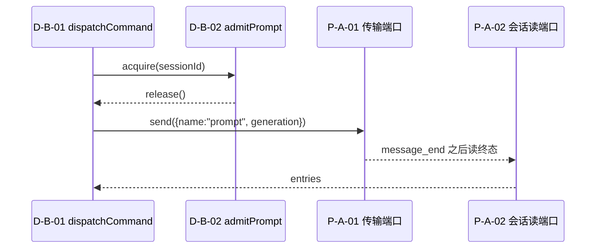

# S-01 一条 prompt 的跨边界时序

```mermaid
sequenceDiagram
    participant O as D-B-01 dispatchCommand
    participant A as D-B-02 admitPrompt
    participant T as P-A-01 传输端口
    participant S as P-A-02 会话读端口
    O->>A: acquire(sessionId)
    A-->>O: release()
    O->>T: send({name:"prompt", generation})
    T-->>S: message_end 之后读终态
    S-->>O: entries
```
