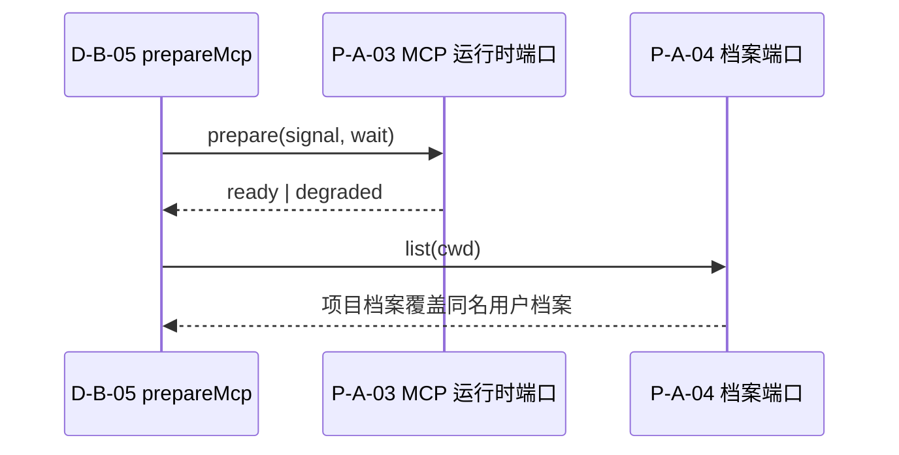

# S-02 MCP 准备与档案合并

```mermaid
sequenceDiagram
    participant P as D-B-05 prepareMcp
    participant M as P-A-03 MCP 运行时端口
    participant R as P-A-04 档案端口
    P->>M: prepare(signal, wait)
    M-->>P: ready | degraded
    P->>R: list(cwd)
    R-->>P: 项目档案覆盖同名用户档案
```
